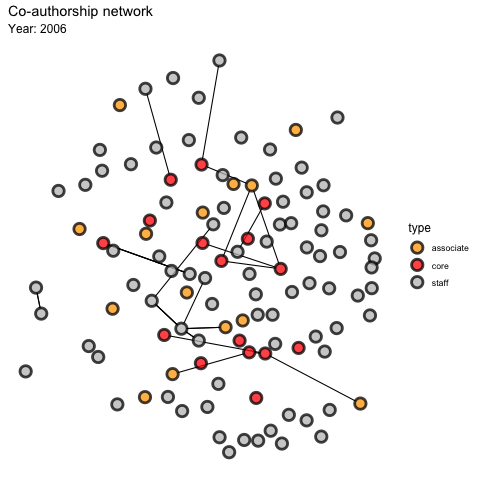
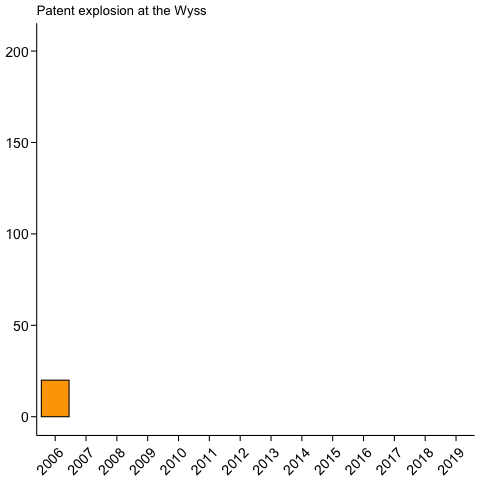

# Wyss-alizer

Visualization of publication network for the [Wyss Institute](http://www.wyss.harvard.edu). These visualizations were done in R using the `RISmed` and `scholar` packages to perform the searches of PubMed and Google Scholar (respectively), as well as with `ggplot2`, `ggraph`, and `ganimate` for plotting and animations.

## Co-authorship network
Based on works collected through Google Scholar and PubMed, we were able to build a co-authorship network for core faculty. associate faculty, and technical staff members of the [Wyss Institute](http://www.wyss.harvard.edu).

## Patents at the Wyss
Additionally, the collected works showcase how collaborations and partnerships at the [Wyss Institute](http://www.wyss.harvard.edu) have resulted in a significant increase in patent applications and issued patents by the Wyss community.

## Contact us
For more on the data shown here, please contact [Diogo M. Camacho](mailto:diogo.camacho@wyss.harvard.edu).
